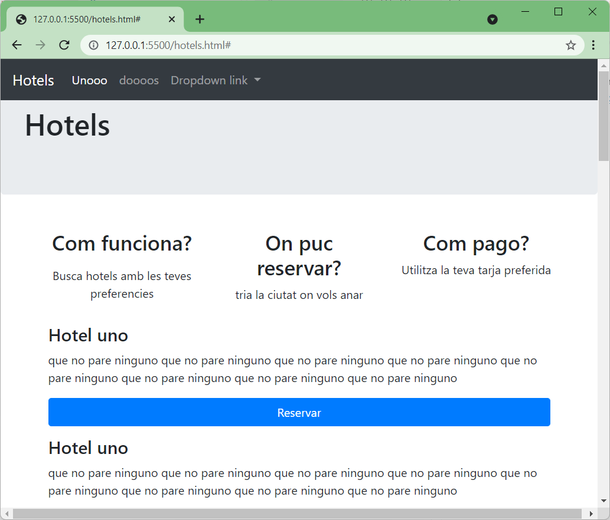

# MP05 UF01: Activitat Hotels

1. Crear un grup dos alumnes.
1. Crear una carpeta local a un dels vostres ordinadors.
1. Descompirmir el contingut del fitxer [MP05_UF01_0006_hotels.zip](MP05_UF01_0006_hotels.zip)
1. Inicialitzar un repositori a la carpeta del vostre **repositori local**.
1. Afegir tots els fitxers (*els dos que hi ha*) per fer el seguiment del canvis de la pàgina web.
1. Crear el primer **```commmit```** amb el comentari ```"Primer commit del grup ```\<**``Cognom primer alumne``**>``` i ```\<**``Cognom segon alumne``**>```"```
1. Crear un repositori al [github.com](https://www.github.com) de l'alumne que apareix abans a la llista de classe.
    1. Nom **repositori**: **\<Cognom primer alumne>_&lt;Cognom segon alumne>*_Act_Hotels*** 
    1. Tipus: **```Privat```**.
    1. Convidar al company de grup.
    1. Convidar a l'usuari ***```joanpardogine```***.

## Estat inicial de la web




### Només hi ha branca **```main```**.


Cal que cadascun del alumnes crei una nova branca **des de** la branca **```main```**.

1. ```git checkout -b <novaBranca>```
1. Nom de la nova branca: **```CognomAfegirMevaInformacio```**
1. Tasques a fer (**cada alumne a la seva branca**)
    1. Crear una nova pàgina **```HTML```** (**```cognom.html```**) amb la vostra informació.
    1. Afegir al menu de **```hotels.html```** un enllaç a aquesta nova pàgina **```HTML```**.

        Dins del menú **```Dropdown link```** => **```Sobre nosaltres...```** 